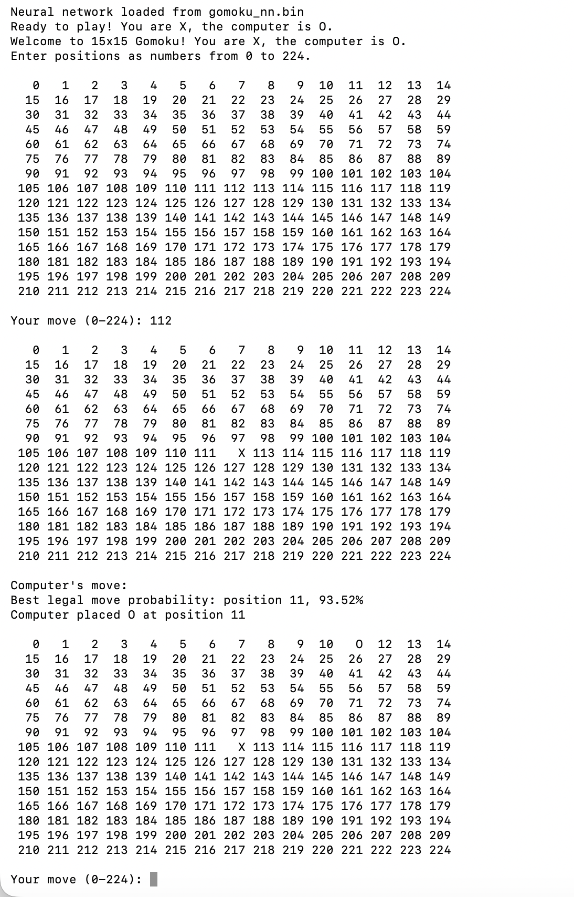

# gomoku-rl-study

This repo keeps the original common.h / train.c / play.c / Makefile structure from Arthur Chiao's tic-tac-toe reinforcement learning example, and modifies it into a 15x15 Gomoku experiment.

## Main changes

Compared with the original tic-tac-toe version:

- Board size: 3x3 -> 15x15
- Board positions: 9 -> 225
- Input size: 18 -> 450
- Output size: 9 -> 225
- Win condition: 3 in a row -> 5 in a row
- Human input: 0-8 -> 0-224
- Game-over checking: fixed tic-tac-toe lines -> directional five-in-a-row checking

## Training and evaluation experiments

After removing the rule-based tactical check, I kept move selection in `./play` based only on the neural network output.

I first improved the original MLP setup by adjusting the training configuration:

- Increased `NN_HIDDEN_SIZE` from 100 to 256.
- Increased `MAX_REPLAY_MOVES` from 40 to 80.
- Increased training from 1000 games to 5000 games.

With `./train 5000`, the model reached a high win rate against a random player. However, I treated this only as a sanity check, because winning against a random opponent did not mean the model was strong in human play.

After manual testing, I found that the model was still weak against a human player. It could sometimes place moves near human threats, but it often failed to block the exact winning point.

To improve the neural-network-only version, I then tested several additional approaches:

- mixed training with random games and self-play
- synthetic tactical pretraining
- human-vs-model game logging
- human-augmented fine-tuning
- single-label threat examples
- a deeper MLP experiment
- clean supervised tactical data generation
- automatic tactical benchmarks
- failure-driven fine-tuning from manual play failures

The goal was to improve the model through training data and neural-network learning, not by adding rule-based move selection during play.

## Supervised tactical pipeline

I added a more systematic supervised tactical data pipeline. The generated training examples include tactical situations such as:

- winning with four-in-a-row
- blocking the opponent's four-in-a-row
- blocking broken four patterns
- blocking open three patterns
- follow-up blocking after one side has already been blocked
- extending the model's own open three

I also added automatic benchmark tools to evaluate tactical behavior more consistently instead of relying only on manual screenshots.

Example benchmark command:

```bash
cd src
./benchmark gomoku_pipeline_e10.bin 1000
```
I also added a CSV benchmark for supervised tactical test data:
```bash
./benchmark_csv gomoku_pipeline_e10.bin ../run_logs/tactical_pipeline_test.csv
```
## Benchmark results

The supervised tactical pipeline improved the automatic benchmark results.

| Model                           | CSV tactical benchmark | block four | broken four | open three | follow-up block |
| ------------------------------- | ---------------------: | ---------: | ----------: | ---------: | --------------: |
| `gomoku_stronger_humanplay.bin` |                 53.26% |     80.90% |      98.20% |     76.10% |          56.60% |
| `gomoku_pipeline_e5.bin`        |                 68.84% |     82.40% |     100.00% |     97.80% |          64.60% |
| `gomoku_pipeline_e10.bin`       |                 70.18% |     82.20% |     100.00% |     99.00% |          69.20% |

Although the benchmark improved, the improvement did not fully transfer to manual human play. In interactive games, the model could still miss obvious horizontal or vertical threats and allow the human player to win directly.

## Final observation

The current MLP-based model can learn some tactical correlations, but it still does not reliably understand the spatial structure of a 15x15 Gomoku board in real play.

The strongest result from this stage is not a fully strong Gomoku player, but a clearer experimental finding:

- Random-opponent win rate is not enough to evaluate model strength.
- Tactical benchmark scores can be improved with cleaner supervised data.
- Manual play is still necessary because benchmark improvement may not fully transfer to real human interaction.
- Further improvement likely requires a stronger model design, such as a CNN-based policy, or a more advanced supervised/search-generated training pipeline.

## Files

- `src/common.h`: board representation, neural network structure, forward pass, move selection, win checking, save/load functions
- `src/train.c`: training loop and experiment training modes
- `src/play.c`: interactive human-vs-computer play mode
- `src/benchmark.c`: automatic benchmark for generated tactical positions
- `src/benchmark_csv.c`: benchmark for CSV supervised tactical test data
- `src/finetune_csv.c`: supervised fine-tuning from CSV training examples
- `src/Makefile`: build commands
- `tools/generate_tactical_pipeline.py`: generates clean supervised tactical train/test data
- `tools/extract_human_threat_examples.py`: extracts human-play threat/failure examples
- `run_logs/`: training logs, benchmark logs, play logs, and experiment notes
- `screenshots/play_demo.png`: final interactive play screenshot

## How to run

Compile:

```bash
cd src
make
```

## Screenshot

Example interactive play result:


